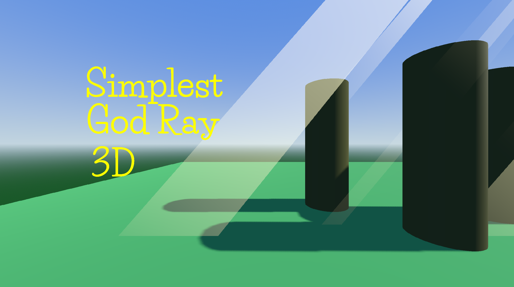

# SimplestGodRay3D

**SimplestGodRay3D** is a custom Node3D for Godot 4 that creates efficient, stylized light shafts (aka god rays) using a single QuadMesh and a shader. It provides an artistic alternative to volumetric fog with much better performance and visual control.

---

## 🚀 Features

- Stylized 3D light shaft using `QuadMesh` + `ShaderMaterial`
- Simulates a trapezoidal volumetric beam using vertex distortion
- Full editor exposure: control width, height, spread, intensity, transparency, fade distance, and color
- Visibility layer support (cull mask compatibility)
- Lightweight and GPU-friendly
- Editor-visible with `@tool` support

---

## ✅ Requirements

- **Godot 4.4+**
- Forward+ rendering mode

---

## 🧪 How to Use

1. Download the simplest_god_ray_3d folder from the Godot assetLib or from gitHub
2. ⚠️**ONLY IF DOWNLOADED FROM GITHUB** In the addons folder of your project(if you don't have one, create it), paste the simplest_god_ray_3d folder
1. Enable the addon from `Project > Project Settings > Plugins`
2. Add a new `SimplestGodRay3D` node to your scene
3. Adjust the exposed parameters in the Inspector:
   - `width`, `height`: size of the beam
   - `spread`: controls the trapezoidal shape
   - `intensity`, `transparency`: affects color and opacity
   - `fade_distance`: controls fade-out over distance
   - `use_occlusion`: enables or disables automatic cut-off with scene geometry using the depth buffer
   - `visibility_layers`: limit visibility to selected cameras

---

## ⚠️ Limitations

- No dynamic shadows.
- Transparent overlap artifacts may occur when multiple beams cross or when mixed with other alpha-based geometry (like Sprite3D).
- Not physically accurate — this is a stylized, artistic effect, so it does not interact with the geometry of the scene.

---

## 🔭 What's Next

Planned improvements for future versions of **SimplestGodRay3D**:

- **✨ Dust Particles**
  - Add optional projected dust motes inside the god ray.

- **🌫️ Embedded Fog Layer**
  - Add support for internal fog/brume projection inside the god ray to simulate light scattering in humid or dense air.

---

## ✨ Author

Developed by Re_Lo.  
If you use this in a project, feel free to share it with me!

---

## 📄 License

MIT License

Copyright (c) 2025 Re_Lo

Permission is hereby granted, free of charge, to any person obtaining a copy
of this software and associated documentation files (the "Software"), to deal
in the Software without restriction, including without limitation the rights
to use, copy, modify, merge, publish, distribute, sublicense, and/or sell
copies of the Software, and to permit persons to whom the Software is
furnished to do so, subject to the following conditions:

The above copyright notice and this permission notice shall be included in all
copies or substantial portions of the Software.

THE SOFTWARE IS PROVIDED "AS IS", WITHOUT WARRANTY OF ANY KIND, EXPRESS OR
IMPLIED, INCLUDING BUT NOT LIMITED TO THE WARRANTIES OF MERCHANTABILITY,
FITNESS FOR A PARTICULAR PURPOSE AND NONINFRINGEMENT. IN NO EVENT SHALL THE
AUTHORS OR COPYRIGHT HOLDERS BE LIABLE FOR ANY CLAIM, DAMAGES OR OTHER
LIABILITY, WHETHER IN AN ACTION OF CONTRACT, TORT OR OTHERWISE, ARISING FROM,
OUT OF OR IN CONNECTION WITH THE SOFTWARE OR THE USE OR OTHER DEALINGS IN THE
SOFTWARE.